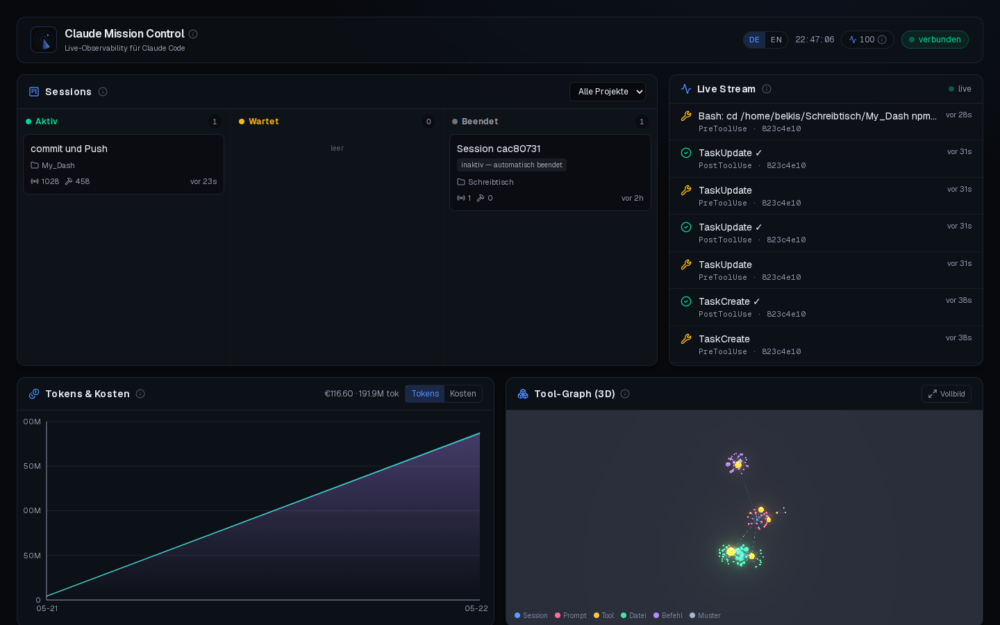
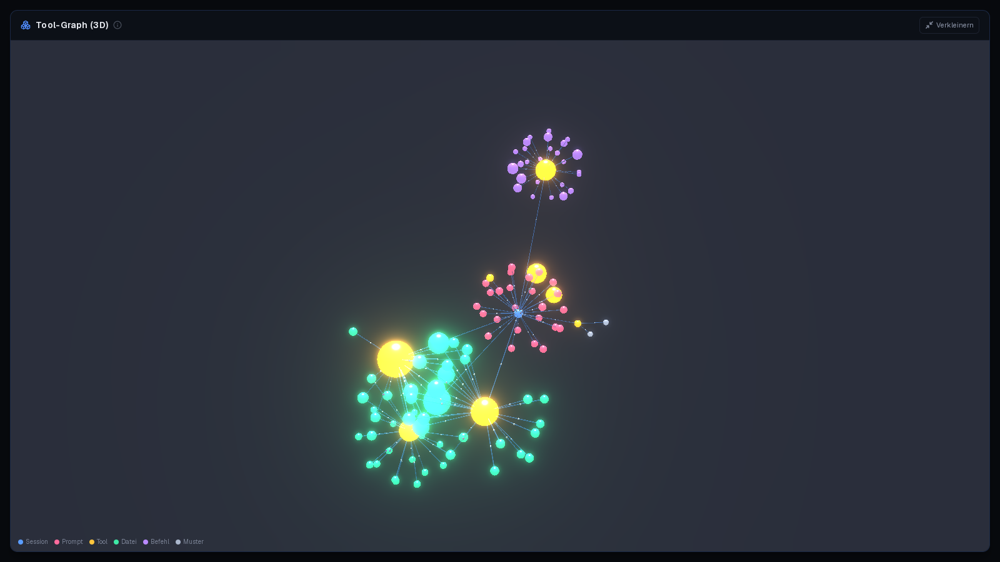

<p align="center">
  
</p>

<p align="center">
  A local, <strong>read-only</strong> observability dashboard for Claude Code —
  live event stream, session Kanban, token/cost charts and a 3D tool-call graph.
</p>

<p align="center">
  
  
  
  
  
</p>

<p align="center">
  
</p>

---

## Demo

**▶ Live demo (runs entirely in your browser):** https://beko2210.github.io/My_Dash/

A static, client-only build (`src/lib/demo.ts`) simulates endless random Claude
tasks, so the full dashboard — live stream, kanban, token/cost charts and the 3D
graph — animates with no server. Deployed from `.github/workflows/pages.yml`
(enable repo → Settings → Pages → Source: **GitHub Actions**).

<!--
  DEMO VIDEOS — placeholders. Drop your two recordings into the `assets/` folder
  with exactly these names:
    • assets/dashboard.mp4   ← screen recording of the dashboard
    • assets/graph-3d.mp4    ← screen recording of the 3D tool graph
  Format: MP4 (H.264) or WebM, ideally ≤ ~20 MB each. GitHub renders <video>
  inline once the file exists; the link underneath is the fallback.
-->

### Dashboard

<p align="center">
  
</p>

<video src="assets/dashboard.mp4" controls muted playsinline width="100%"></video>

▶️ [assets/dashboard.mp4](assets/dashboard.mp4) <!-- placeholder — replace with your recording -->

### 3D tool graph

<p align="center">
  
</p>

<video src="assets/graph-3d.mp4" controls muted playsinline width="100%"></video>

▶️ [assets/graph-3d.mp4](assets/graph-3d.mp4) <!-- placeholder — replace with your recording -->

---

## Why

Most attempts at a "Claude dashboard" fail because they ask the LLM to *render* the
UI. That's the wrong mental model. Real dashboards (Grafana, Datadog) are
**read-only projections of an event log**.

> **The golden rule:** data flows one way — `Hooks → /api/ingest → SQLite → UI`.
> The LLM never renders this dashboard; it only *triggers* events. The single write
> path is `/api/ingest`, fed exclusively by Claude Code hooks (machine events).

## Features

- **Live stream** — every tool call, prompt and lifecycle event in real time (SSE).
- **Session Kanban** — sessions flow through `Aktiv → Wartet → Beendet`, filterable by project.
- **Tokens & cost** — daily usage via [`ccusage`](https://github.com/ryoppippi/ccusage), in USD **and** EUR.
- **3D tool-call graph** — Session → Tool → File, revealing structure across sessions.
- **Plugin-ready** — new panels drop in via a registry; the seam for future plugins.
- **Never in the way** — the hook forwarder is fire-and-forget and never blocks Claude.

## Architecture

```
Claude Code CLI (your machine)
  └─ hook fires (PreToolUse, PostToolUse, Stop, SessionStart/End, …)
       └─ scripts/claude-hook.sh   (stdin JSON → curl, --max-time 1, never blocks Claude)
            └─ POST 127.0.0.1:3000/api/ingest      ← the ONLY write path
                 ├─ writes events + updates sessions/tool_calls (better-sqlite3)
                 └─ broadcasts via in-memory bus
                      └─ GET /api/stream (SSE) → widgets update live

Side sources (read-only):
  ~/.claude/projects/**/*.jsonl → scripts/import-history.mjs  (backfill)
  npx ccusage --json            → /api/usage                 (tokens & cost)
```

One Next.js process. SQLite file at `./data/mission-control.db` (gitignored).

## Quick start

**One click (Linux):**

```bash
./install.sh                  # installs deps, wires hooks, builds, starts, opens the browser
```

It also drops a **“Claude Mission Control” launcher on your Desktop** — double-click it to start anytime.

**Manual:**

```bash
cp .env.example .env          # optional: tweak port / EUR rate
npm install
npm run dev                   # http://127.0.0.1:3000   (or ./start.sh for a prod build)
npm run seed                  # inject demo events to see the full UI immediately
npm run install-hooks         # wire hooks into ~/.claude/settings.json (backs it up first)
npm run import-history        # optional: backfill past sessions from transcripts
```

Restart any running Claude Code session after `install-hooks`, then watch it appear live.

## Adding a plugin (widget)

The dashboard is a plugin grid. To add a panel:

1. Create `src/plugins/<your-plugin>/widget.tsx` exporting a React component
   (wrap your content in `<Panel title="…">`).
2. (Optional) add a read-only API route at `src/app/api/<your-plugin>/route.ts`.
3. Register it in `src/plugins/registry.ts`.

That's it — the grid renders it automatically. This is the seam reserved for the
future Obsidian knowledge-graph / semantic-search plugins.

## Configuration (`.env`)

| Var | Default | Meaning |
|-----|---------|---------|
| `MC_PORT` | `3000` | Port (bound to `127.0.0.1` only) |
| `EUR_PER_USD` | `0.92` | USD→EUR factor for cost display (ccusage reports USD) |
| `MC_HOOK_TOKEN` | _(empty)_ | Optional shared secret; if set, ingest requires it |
| `CLAUDE_DIR` | `~/.claude` | Where Claude Code stores transcripts/usage |

## Project layout

```
src/
├─ app/                 # Next.js routes + API (the read paths + the single /api/ingest write path)
│  ├─ api/{ingest,stream,sessions,events,graph,usage}/route.ts
│  └─ icon.svg          # favicon (auto-picked up by Next)
├─ lib/                 # db, event bus, ingest projection, ccusage, formatting
├─ plugins/             # ◀ widgets: live-stream, kanban, token-chart, tool-graph + registry.ts
└─ components/          # dashboard shell, live SSE provider, panel
scripts/                # claude-hook.sh, install-hooks, import-history, seed-demo
assets/                 # logo + animated demo
```

Then reference `assets/demo-real.gif` in this README.

---

<p align="center"><sub>read-only · Hooks → SQLite → UI · the AI never renders this dashboard</sub></p>
