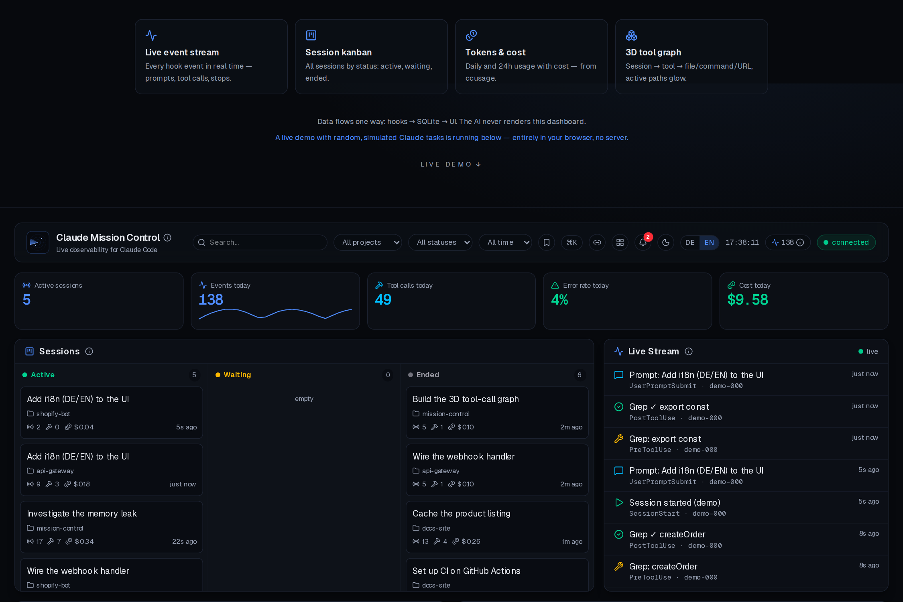
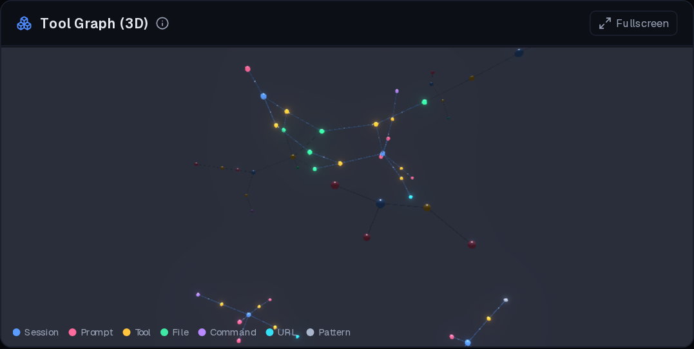
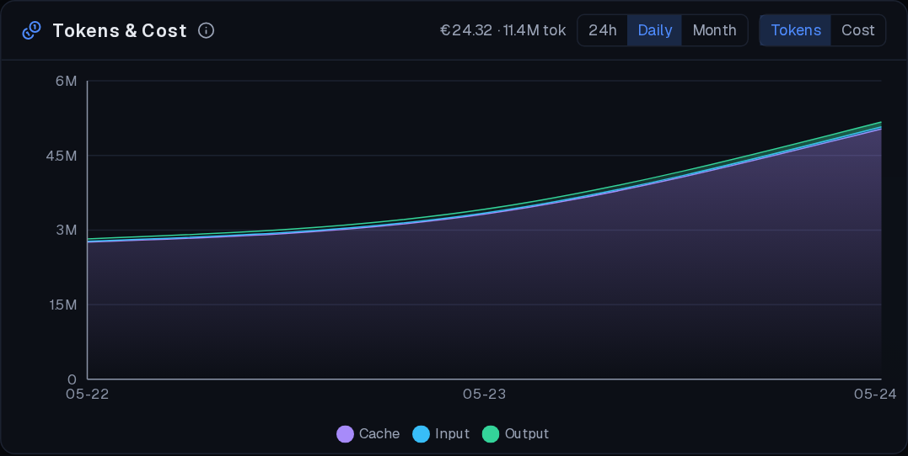
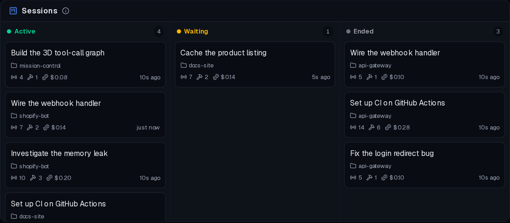
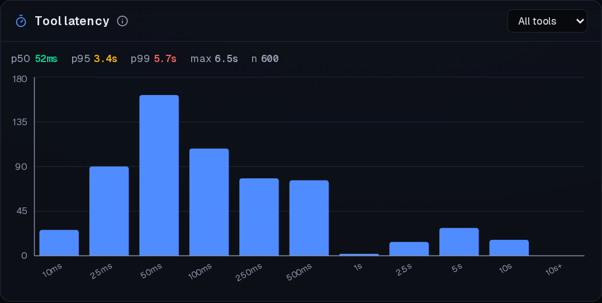

<p align="center">
  
</p>

<p align="center">
  
</p>

<p align="center">
  A local, <strong>read-only</strong> observability dashboard for Claude Code —
  live event stream, session Kanban, token/cost charts and a 3D tool-call graph.
</p>

<p align="center">
  
  
  <a href="https://github.com/BEKO2210/My_Dash/releases"></a>
  <a href="https://beko2210.github.io/My_Dash/"></a>
  <a href="LICENSE"></a>
  <a href="CONTRIBUTING.md"></a>
  
  
</p>

<p align="center">
  
  
  
  
  
  
  
</p>

<p align="center">
  <em>Public beta (v1.0.0-beta)</em> — local-first and usable today. The data contract
  (<code>Hooks → /api/ingest → SQLite → UI</code>) is stable; more widgets land via the plugin registry.
</p>

---

## Demo

**▶ Live demo (runs entirely in your browser):** https://beko2210.github.io/My_Dash/

A static, client-only build (`src/lib/demo.ts`) simulates endless random Claude
tasks, so the full dashboard — live stream, kanban, token/cost charts and the 3D
graph — animates with no server. Deployed from `.github/workflows/pages.yml`
(enable repo → Settings → Pages → Source: **GitHub Actions**).

### Screenshots

<p align="center">
  
</p>

<table>
  <tr>
    <td width="50%"><br><sub><b>3D tool-call graph</b> — session → tool → file/command/URL, active paths glow</sub></td>
    <td width="50%"><br><sub><b>Tokens &amp; cost</b> — daily and 24h usage with cost</sub></td>
  </tr>
  <tr>
    <td><br><sub><b>Session kanban</b> — every session by status</sub></td>
    <td><br><sub><b>Latency</b> — response/tool runtimes, outliers visible</sub></td>
  </tr>
</table>

<sub>Screenshots are generated deterministically from the demo by
<a href="scripts/gallery.mjs"><code>scripts/gallery.mjs</code></a> (every widget in light &amp; dark lives under
<a href="public/shots/"><code>public/shots/</code></a>); the <a href="https://beko2210.github.io/My_Dash/">live demo</a> shows it all animated.</sub>

---

## Features in action

The full dashboard puts the kanban, live stream, token/cost chart and the 3D
tool-call graph in one read-only view:

- **Global search** — filter the live stream and the session kanban straight from the header (or `⌘/Ctrl-K`).
- **Session details** — click any kanban card for its status, timings, counts and recent events; jump to the full session page with its transcript.
- **Make it yours** — drag-and-drop reorder panels, resize them, add/remove widgets from the gallery, switch light/dark and pick an accent colour. Layout persists locally.

---

## Why

Most attempts at a "Claude dashboard" fail because they ask the LLM to *render* the
UI. That's the wrong mental model. Real dashboards (Grafana, Datadog) are
**read-only projections of an event log**.

> **The golden rule:** data flows one way — `Hooks → /api/ingest → SQLite → UI`.
> The LLM never renders this dashboard; it only *triggers* events. The single write
> path is `/api/ingest`, fed exclusively by Claude Code hooks (machine events).

## Features

- **Live stream** — every tool call, prompt and lifecycle event in real time (SSE), virtualized for long histories.
- **Session Kanban** — sessions flow through `Aktiv → Wartet → Beendet`, filterable by project, with full session detail + transcript pages.
- **Tokens & cost** — daily usage via [`ccusage`](https://github.com/ryoppippi/ccusage) in USD **and** EUR, budgets with burn-rate projection, and **30 built-in widgets** (heatmaps, latency, reliability, anomalies, model mix, git/PR correlation…) — extensible via the plugin registry.
- **3D tool-call graph** — Session → Tool → File, revealing structure across sessions.
- **Alerts & notifications** — rule-based alerts at ingest, in-app inbox + toasts, desktop notifications, optional Slack/Discord webhook, quiet hours and a daily/weekly digest.
- **Themes & i18n** — light/dark plus accent colours; full German/English UI.
- **Plugin platform** — widgets are registry entries; drop external ones into `plugins.local/` (see [docs/PLUGINS.md](docs/PLUGINS.md)).
- **Open data hub** — read-only `/api/*` routes, CSV/JSON export, an OpenAPI 3.1 spec (`/api/openapi`), a Prometheus endpoint (`/api/metrics`) and an optional OTLP receiver.
- **Never in the way** — the hook forwarder is fire-and-forget and never blocks Claude; the dashboard is local-only (`127.0.0.1`) and read-only.

## Architecture

```
Claude Code CLI (your machine)
  └─ hook fires (PreToolUse, PostToolUse, Stop, SessionStart/End, …)
       └─ scripts/claude-hook.sh   (stdin JSON → curl, --max-time 1, never blocks Claude)
            └─ POST 127.0.0.1:3000/api/ingest      ← the ONLY write path
                 ├─ writes events + updates sessions/tool_calls (better-sqlite3)
                 └─ broadcasts via in-memory bus
                      └─ GET /api/stream (SSE) → widgets update live

Side sources (read-only, opt-in):
  ~/.claude/projects/**/*.jsonl → scripts/import-history.mjs  (backfill)
  npx ccusage --json            → /api/usage                 (tokens & cost)
  OTLP/HTTP (Claude Code OTel)  → /api/otlp/v1/*             (MC_OTLP_ENABLED=1)
  another machine's DB          → scripts/sync-machine.mjs   (combined view)

Read-only outputs (for integration):
  /api/openapi   OpenAPI 3.1 spec      /api/metrics  Prometheus scrape
  /api/export    CSV/JSON export       /api/digest   daily/weekly HTML digest
```

One Next.js process. SQLite file at `./data/mission-control.db` (gitignored).

## Install (desktop app)

### ⬇️ [Downloads — Windows · macOS · Linux](https://github.com/BEKO2210/My_Dash/releases)

Double-click installers are built by the release workflow and attached to the
[GitHub Releases](https://github.com/BEKO2210/My_Dash/releases) (the beta is a
**pre-release**, so grab it from the releases list):

| OS | Installer |
|----|------|
| Windows | `Claude-Mission-Control-Setup-<version>.exe` (NSIS installer) |
| macOS | `Claude-Mission-Control-<version>-arm64.dmg` (Apple Silicon) / `Claude-Mission-Control-<version>-x64.dmg` (Intel) |
| Linux | `Claude-Mission-Control-<version>-<arch>.AppImage` (portable) or `.deb` |

> **Beta note — the installers are unsigned.** This is an early public beta, so your
> OS will warn before running it:
> - **Windows:** SmartScreen → *More info* → **Run anyway**.
> - **macOS:** right-click the app → **Open** (the first launch only); or
>   *System Settings → Privacy & Security → Open Anyway*.
> - **Linux (AppImage):** `chmod +x Claude-Mission-Control-*.AppImage` then run it.

The app bundles its own Node runtime (nothing to install separately). It runs in the
background with a tray icon — click the tray → **Connect Claude Code (install hooks)**,
then restart any open Claude Code session and activity appears live. It can auto-start at
login and keeps the ingest server running when the window is closed. The local database
lives in your OS user-data folder.

### Build the installers yourself

```bash
npm install
npm run dist          # installer for your current OS → dist/
npm run dist:win      # or target a specific OS (build each on that OS, e.g. via CI)
npm run dist:mac
npm run dist:linux
```

CI (`.github/workflows/release.yml`) builds all three on a tag push (`v*`).

## Quick start (from source)

**One click (Linux):**

```bash
./install.sh                  # installs deps, wires hooks, builds, starts, opens the browser
```

It also drops a **“Claude Mission Control” launcher on your Desktop** — double-click it to start anytime.

**Manual:**

```bash
cp .env.example .env          # optional: tweak port / EUR rate
npm install
npm run dev                   # http://127.0.0.1:3000   (or ./start.sh for a prod build)
npm run seed                  # inject demo events to see the full UI immediately
npm run install-hooks         # wire hooks into ~/.claude/settings.json (backs it up first)
npm run import-history        # optional: backfill past sessions from transcripts
npm test                      # optional: run the unit tests (Vitest)
```

Restart any running Claude Code session after `install-hooks`, then watch it appear live.

## Adding a plugin (widget)

The dashboard is a plugin grid. To add a panel:

1. Create `src/plugins/<your-plugin>/widget.tsx` exporting a React component
   (wrap your content in `<Panel title="…">`).
2. (Optional) add a read-only API route at `src/app/api/<your-plugin>/route.ts`.
3. Register it in `src/plugins/registry.ts`.

That's it — the grid renders it automatically. This is the seam reserved for the
future Obsidian knowledge-graph / semantic-search plugins.

## Configuration (`.env`)

| Var | Default | Meaning |
|-----|---------|---------|
| `MC_PORT` | `3000` | Port (bound to `127.0.0.1` only) |
| `EUR_PER_USD` | `0.92` | USD→EUR factor for cost display (ccusage reports USD) |
| `MC_HOOK_TOKEN` | _(empty)_ | Optional shared secret; if set, ingest requires it |
| `CLAUDE_DIR` | `~/.claude` | Where Claude Code stores transcripts/usage |

## Project layout

```
src/
├─ app/                 # Next.js routes + API (the read paths + the single /api/ingest write path)
│  ├─ api/{ingest,stream,sessions,events,graph,usage}/route.ts
│  └─ icon.svg          # favicon (auto-picked up by Next)
├─ lib/                 # db, event bus, ingest projection, ccusage, formatting
├─ plugins/             # ◀ widgets: live-stream, kanban, token-chart, tool-graph + registry.ts
└─ components/          # dashboard shell, live SSE provider, search, panel
scripts/                # claude-hook.sh, install-hooks, import-history, seed-demo, packaging
electron/               # desktop shell (main process + build icon) — packaged via electron-builder
assets/                 # logo, icon, demo clips (gif/mp4) + screenshots
```

## Tests

```bash
npm test         # unit tests (Vitest)
npm run lint     # ESLint (Next.js config)
npm run build    # production build (also type-checks)
```

## API & data hub

Every widget is backed by a read-only `/api/*` route; the only write path for hook
data is `POST /api/ingest`. The full HTTP surface is described by an **OpenAPI 3.1**
spec served at [`/api/openapi`](http://127.0.0.1:3000/api/openapi) (also reachable
from the command palette → "Open API spec"). Bulk **export** is available at
`/api/export` (JSON bundle or per-table JSON/CSV) and a **Prometheus** scrape
endpoint at `/api/metrics`. See [docs/EXPORT.md](docs/EXPORT.md) for the data schema.

## Contributing

See [CONTRIBUTING.md](CONTRIBUTING.md). In short: keep the one-way data flow
(`Hooks → /api/ingest → SQLite → UI`) intact, and run `npm test` + `npm run lint`
before opening a pull request.

By participating, you agree to the [Code of Conduct](CODE_OF_CONDUCT.md).

## Community & policies

- 📦 [Changelog](CHANGELOG.md) — what changed in each release
- 🤝 [Contributing guide](CONTRIBUTING.md)
- 📜 [Code of Conduct](CODE_OF_CONDUCT.md)
- 🔒 [Security policy](SECURITY.md) — how to report a vulnerability
- 💼 [Commercial licensing](COMMERCIAL.md)

## License

**Source-available, dual-licensed.** Noncommercial use is free under the
[PolyForm Noncommercial License 1.0.0](LICENSE) (personal projects, research,
education, nonprofits, evaluation). **Commercial use requires a separate
commercial license** — see [COMMERCIAL.md](COMMERCIAL.md).

© 2026 Belkis Aslani

---

<p align="center"><sub>read-only · Hooks → SQLite → UI · the AI never renders this dashboard</sub></p>
